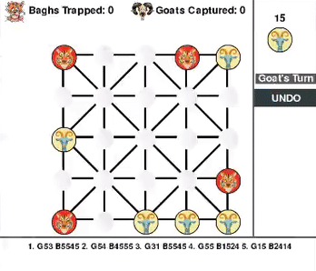

# AlphaBaghChal 
 
Bagh Chal is one of the many variants of the tiger hunting board games played locally in South East Asia. The strategic, two-player board game is played on a 5x5 grid.

Inspired by AlphaZero, the project tries to use state-of-the-art methods in the deep reinforcement learning paradigm to master the traditional Nepali board game of Bagh Chal through self-play. It uses a single deep residual convolutional neural network which takes in a multilayered binary board state and outputs both the game policy and value, along with Monte Carlo Tree Search.

Check out the accompanying blog where I write about my experience developing this self-learning AI agent: [Mastering Bagh Chal with self-learning AI](https://www.programiz.com/blog/mastering-bagh-chal-with-self-learning-ai/)

 

## Todos 
 
 - Tabula Rasa Learning 
 - Better training 
 - Pytorch version
